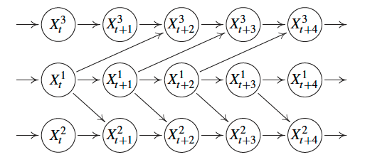
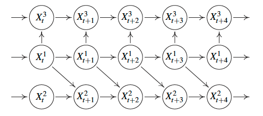
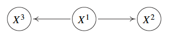
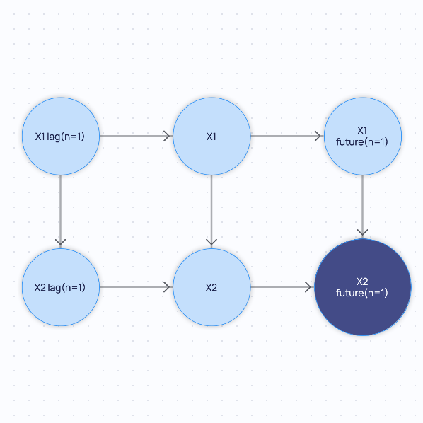
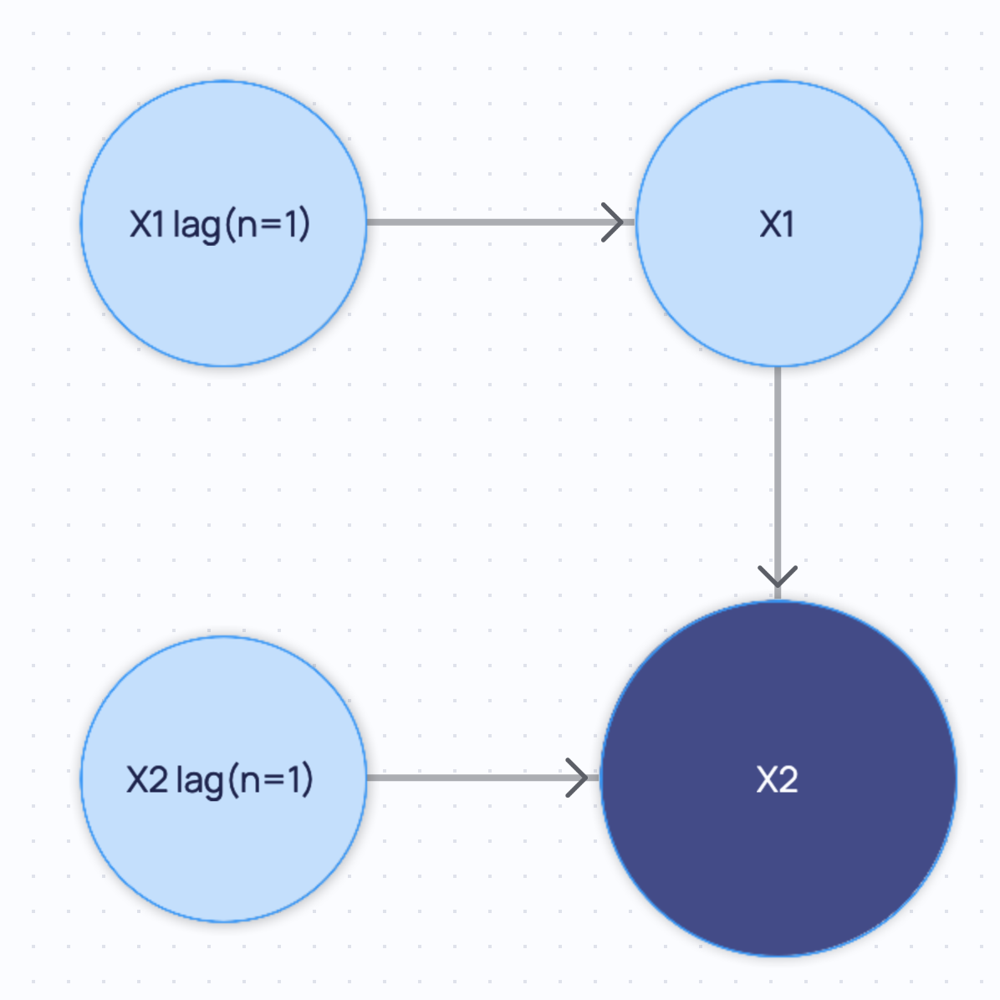
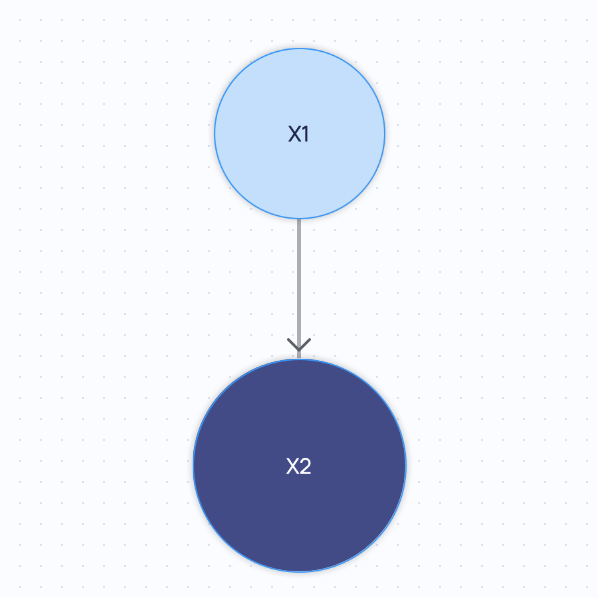
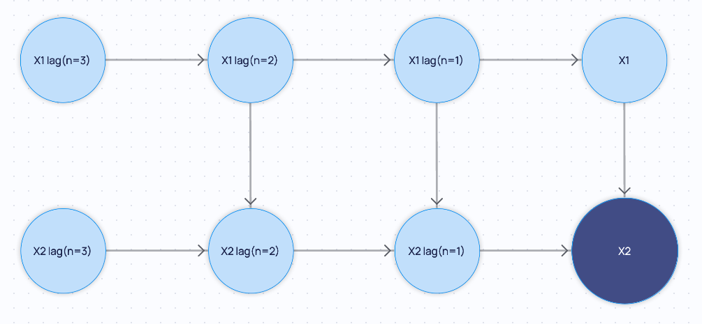
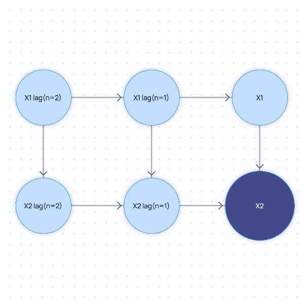

# Time Series Causal Graph
The class `cai_causal_graph.time_series_causal_graph.TimeSeriesCausalGraph`, inheriting directly from 
`cai_causal_graph.causal_graph.CausalGraph`, extends causal graphs to time series data.

For the theoretical background of causality for time series, please refer to Chapter 10 of _Peters, J., Janzing, D. and 
Schölkopf, B., 2017. Elements of causal inference: foundations and learning algorithms (p. 288). The MIT Press_. 

The main addition of `cai_causal_graph.time_series_causal_graph.TimeSeriesCausalGraph` lies in representing the time 
information in each node. The new `cai_causal_graph.graph_components.TimeSeriesNode` class inherits from the 
corresponding `cai_causal_graph.graph_components.Node` and keeps all original properties:
- `cai_causal_graph.graph_components.Node.identifier`
- `cai_causal_graph.graph_components.Node.variable_type`

The `cai_causal_graph.graph_components.TimeSeriesNode` class has two additional properties:
- `cai_causal_graph.graph_components.TimeSeriesNode.time_lag`: the time difference with respect to the reference time 0.
- `cai_causal_graph.graph_components.TimeSeriesNode.variable_name`: the name of the variable (without the lag information).

The `cai_causal_graph.graph_components.TimeSeriesNode` can be instantiated as follows:

```python
from cai_causal_graph.graph_components import TimeSeriesNode

# Via identifier
ts_node = TimeSeriesNode(identifier='X lag(n=1)')

# Via time lag and variable name
ts_node = TimeSeriesNode(time_lag=-1, variable_name='X')
```

However, it is easier to just add nodes directly to the `cai_causal_graph.time_series_causal_graph.TimeSeriesCausalGraph`.

The format of the identifier is the following: 
- `f'{variable_name}'` if `time_lag == 0`
- `f'{variable_name} lag(n={time_lag})'` if `time_lag < 0`
- `f'{variable_name} future(n={time_lag})'` if `time_lag > 0`

## Examples of time series causal graphs
The following examples have been drawn from _Peters, J., Janzing, D. and Schölkopf, B., 2017. Elements of causal 
inference: foundations and learning algorithms (p. 288). The MIT Press_.

Example of a time series causal graph with no instantaneous effects, i.e., no edges between nodes at the same time stamp.



Example of a time series causal graph with instantaneous effects, i.e., there are edges between nodes at the same time stamp.



Summary graph of the full time series causal graphs above.



## Construction

### Direct initialization
You can instantiate a `cai_causal_graph.time_series_causal_graph.TimeSeriesCausalGraph` directly using its constructor.

```python
from cai_causal_graph import EdgeType, TimeSeriesCausalGraph

ts_cg = TimeSeriesCausalGraph()
# Nodes are added automatically if they are not in the graph when an edge is added.
ts_cg.add_edge('X1 lag(n=1)', 'X1', edge_type=EdgeType.DIRECTED_EDGE)
ts_cg.add_edge('X2 lag(n=1)', 'X2', edge_type=EdgeType.DIRECTED_EDGE)
ts_cg.add_edge('X1', 'X3', edge_type=EdgeType.DIRECTED_EDGE)
```

### From a `CausalGraph`
Alternatively, you can instantiate a `cai_causal_graph.time_series_causal_graph.TimeSeriesCausalGraph` from a 
`cai_causal_graph.causal_graph.CausalGraph` instance. If the nodes are named correctly, the time information will be
extracted accordingly.

```python
from cai_causal_graph import CausalGraph, EdgeType, TimeSeriesCausalGraph

cg = CausalGraph()
cg.add_edge('X1 lag(n=1)', 'X1', edge_type=EdgeType.DIRECTED_EDGE)
cg.add_edge('X2 lag(n=1)', 'X2', edge_type=EdgeType.DIRECTED_EDGE)
cg.add_edge('X1', 'X3', edge_type=EdgeType.DIRECTED_EDGE)

ts_cg = TimeSeriesCausalGraph.from_causal_graph(cg)
```

The `cai_causal_graph.time_series_causal_graph.TimeSeriesCausalGraph` will have the same nodes and edges as the 
`cai_causal_graph.causal_graph.CausalGraph`, but will be aware of the time information so `'X1 lag(n=1)'` and `'X1'` 
represent the same variable but at different times.

### From an adjacency matrix
You can instantiate a `cai_causal_graph.time_series_causal_graph.TimeSeriesCausalGraph` from an adjacency matrix
and optionally a list of node names.

```python
import numpy
from cai_causal_graph import TimeSeriesCausalGraph

# The adjacency matrix should be a squared binary numpy array
adjacency_matrix: numpy.ndarray

# Simply via the adjacency matrix
ts_cg = TimeSeriesCausalGraph.from_adjacency_matrix(adjacency=adjacency_matrix)

# Also specifying the node names
ts_cg = TimeSeriesCausalGraph.from_adjacency_matrix(
    adjacency=adjacency_matrix, node_names=['X1 lag(n=1)', 'X1', 'X2 lag(n=1)', 'X2', 'X3']
)
```

### From multiple adjacency matrices
You can instantiate a `cai_causal_graph.time_series_causal_graph.TimeSeriesCausalGraph` from a dictionary of adjacency 
matrices, where the keys are the time deltas.
For example, the adjacency matrix with time delta -1 is stored in adjacency_matrices[-1] as would correspond to X-1 -> X,
where X is the set of nodes.

```python
import numpy
from cai_causal_graph import TimeSeriesCausalGraph

adjacency_matrices = {
    -2: numpy.array([[0, 0, 0], [1, 0, 0], [0, 0, 1]]),
    -1: numpy.array([[0, 1, 0], [1, 0, 0], [0, 0, 0]]),
    0: numpy.array([[0, 1, 1], [0, 0, 1], [0, 0, 0]]),
}

# Simply via the adjacency matrices
ts_cg = TimeSeriesCausalGraph.from_adjacency_matrices(adjacency_matrices=adjacency_matrices)

# Also specifying the variable names
ts_cg = TimeSeriesCausalGraph.from_adjacency_matrices(adjacency_matrices=adjacency_matrices, variable_names=['X', 'Y', 'Z'])
```

## Query the nodes and the variables
You can extract all the variable names from the nodes of the `cai_causal_graph.time_series_causal_graph.TimeSeriesCausalGraph`.

```python
from cai_causal_graph import TimeSeriesCausalGraph

ts_cg: TimeSeriesCausalGraph

# Return a list of variable names from a list of node names
node_names = ['X', 'X lag(n=1)', 'Y', 'Z lag(n=2)']
ts_cg.get_variable_names_from_node_names(node_names)
# This will return ['X', 'Y', 'Z']
```

Conversely, you can extract a list of `cai_causal_graph.graph_components.TimeSeriesNode`s in the graph from a given list of identifiers.

```python
from typing import List
from cai_causal_graph import TimeSeriesCausalGraph
from cai_causal_graph.graph_components import TimeSeriesNode

ts_cg: TimeSeriesCausalGraph

# A single node (it will be a list with one element)
variable: List[TimeSeriesNode] = ts_cg.get_nodes(identifier='X lag(n=1)')

# Multiple nodes
variables: List[TimeSeriesNode] = ts_cg.get_nodes(identifier=['X', 'X lag(n=1)'])
```

## Add nodes
You can add a `cai_causal_graph.graph_components.TimeSeriesNode` to the `cai_causal_graph.time_series_causal_graph.TimeSeriesCausalGraph`.

```python
from cai_causal_graph import NodeVariableType, TimeSeriesCausalGraph
from cai_causal_graph.graph_components import TimeSeriesNode

ts_cg: TimeSeriesCausalGraph

# Via a node object
new_node = TimeSeriesNode(time_lag=-3, variable_name='X')
ts_cg.add_node(node=new_node)

# Via identifier
ts_cg.add_node(identifier='X lag(n=3)')

# Via variable name and time lag
ts_cg.add_node(variable_name='X', time_lag=-33)

# Variable type can also be specified
ts_cg.add_node(identifier='X lag(n=3)', variable_type=NodeVariableType.CONTINUOUS)
```

## Add edges
You can add time series edges to the `cai_causal_graph.time_series_causal_graph.TimeSeriesCausalGraph`.

```python
from cai_causal_graph import EdgeType, TimeSeriesCausalGraph

ts_cg: TimeSeriesCausalGraph

# Via identifier (the edge type can be specified if desired)
ts_cg.add_edge(source='X lag(n=3)', destination='Y lag(n=3)', edge_type=EdgeType.DIRECTED_EDGE)

# Add edge by pair (the edge type can be specified if desired)
ts_cg.add_edge_by_pair(pair=('X lag(n=2)', 'Y lag(n=2)'), edge_type=EdgeType.DIRECTED_EDGE)

# Add multiple edges by specifying tuples of source and destination node identifiers and with default setup
ts_cg.add_edges_from(pairs=[('X lag(n=2)', 'Y lag(n=2)'), ('X lag(n=3)', 'Y lag(n=3)')])

# Via time edge
ts_cg.add_time_edge(source_variable='X', source_time=-2, destination_variable='Y', destination_time=-2, edge_type=EdgeType.DIRECTED_EDGE)
```

## Replace nodes
Replace a node in the `cai_causal_graph.time_series_causal_graph.TimeSeriesCausalGraph`.

```python
from cai_causal_graph import NodeVariableType, TimeSeriesCausalGraph

ts_cg: TimeSeriesCausalGraph

# Via identifier
ts_cg.replace_node(node_id='X lag(n=3)', new_node_id='Y lag(n=3)')
# Via variable name and time lag
ts_cg.replace_node(node_id='X lag(n=3)', time_lag=3, variable_name='Y')

# Variable type can also be specified
ts_cg.replace_node(node_id='X lag(n=3)', new_node_id='Y lag(n=3)', variable_type=NodeVariableType.CONTINUOUS)
```

## Delete nodes and edges
You can delete nodes and edges from the `cai_causal_graph.time_series_causal_graph.TimeSeriesCausalGraph`.

```python
from cai_causal_graph import EdgeType, TimeSeriesCausalGraph

ts_cg: TimeSeriesCausalGraph

# Delete node
ts_cg.delete_node(identifier='X lag(n=3)')

# Delete edge (the edge type can be specified if desired)
ts_cg.delete_edge(source='X lag(n=3)', destination='Z lag(n=3)', edge_type=EdgeType.DIRECTED_EDGE)

# Delete edge from pair (the edge type can be specified if desired)
ts_cg.remove_edge_by_pair(pair=('X lag(n=3)', 'Z lag(n=3)'), edge_type=EdgeType.DIRECTED_EDGE)
```

## Minimal graph
The minimal graph is the graph with the minimal number of edges that is equivalent to the original graph.
In other words, it is a graph that has no edges whose destination is not time delta 0.

```python
from cai_causal_graph import TimeSeriesCausalGraph

ts_cg: TimeSeriesCausalGraph

# Check whether a graph is in its minimal form
# Returns True if the graph is a minimal graph, False otherwise
is_minimal = ts_cg.is_minimal_graph()

# Get the minimal graph
minimal_graph: TimeSeriesCausalGraph = ts_cg.get_minimal_graph()
```

## Summary graph
You can collapse the graph in time into a single node per variable (column name).
This can become cyclic and bi-directed as `X(t-1) -> Y` and `Y(t-1) -> X` would become `X <-> Y`.
Note that the summary graph is a `cai_causal_graph.causal_graph.CausalGraph` object.

```python
from cai_causal_graph import CausalGraph, TimeSeriesCausalGraph

ts_cg: TimeSeriesCausalGraph

summary_graph: CausalGraph = ts_cg.get_summary_graph()
```
## Stationary graph

It may be useful to check whether the `cai_causal_graph.time_series_causal_graph.TimeSeriesCausalGraph` is stationary, 
i.e., its edges are not dependent on the corresponding time lags. In other words, the graph is the same for all time lags.

Stationarity is a useful concept for future prediction: if the graph is stationary, it can be used to predict the future
for any time lag. Conversely, if the graph is not stationary, it can only be used to predict the future for the specified 
time lags. Thus, in a stationary graph, if the edge `X lag(n=1) -> Y lag(n=1)` exists, also the edge `X lag(n=2) -> Y lag(n=2)` 
must be present if the nodes `X lag(n=2)` and `Y lag(n=2)` are in the graph.

```python
from cai_causal_graph import TimeSeriesCausalGraph

ts_cg: TimeSeriesCausalGraph

# Check whether a graph is stationary
# Returns True if the graph is a stationary, False otherwise
is_stationary = ts_cg.is_stationary_graph()

# Get the stationary graph
stationary_graph: TimeSeriesCausalGraph = ts_cg.get_stationary_graph()
```

:::note

It is important to note that the minimal graph is not necessarily stationary. Therefore, the underlying process 
defined in the minimal graph does not need to be stationary, but if the minimal graph is non-stationary it does 
not always mean that the process is not stationary. It may only mean that the graph is missing at least one of the 
corresponding edges in time. This is the more likely scenario. Please see the example below of a minimal graph that is 
not stationary as it is missing the edge `X1 lag(n=1) -> X2 lag(n=1)`. Adding that edge would make the graph no longer
minimal so the process may be stationary, but obviously the minimal graph will be non-stationary. The stationary graph 
is obtained by extending (in time) the minimal graph with all the edges to the correct backward and forward time lags.

:::

## Extended graph

You can extend the graph in time by adding nodes for each variable at each time step from `backward_steps` to
`forward_steps`. If a backward step of `n` is specified, it means that the graph will be extended in order to
include nodes back to time `-n` and all the nodes connected to them as specified by the minimal graph. 

By default, in addition to all nodes as far back as `backward_steps`, extra nodes and edges will be added as far back that all nodes 
up to `backward_steps` in the past have all their parents and inbound edges. This means that the extended graph may now 
have nodes at lags further back than `backward_steps`. This behavior ensures that by default, all nodes for the same
variable will have consistent parents, i.e. if a node for variable `'X'` at time `n` has a parent `'Y'` at time `k`, then
a newly added node `'X'` at time `n - j` will have a parent `'Y'` at time `k - j`. This is especially important for
causal modeling tasks, such as Structural Causal Models. This behavior can, however, be disabled by passing
`include_all_parents=False`.

If a forward step of `n` is specified, it means the graph will be extended in order to include nodes forward to time 
`n` and all the nodes connected to them as specified by the minimal graph. `include_all_parents` is only valid when 
specifying a `backward_steps`, and will have no effect on the logic of `forward_steps`. If both `backward_steps` and 
`forward_steps` are `None`, the original graph is returned.

```python
from cai_causal_graph import TimeSeriesCausalGraph

ts_cg: TimeSeriesCausalGraph
backward_steps = 2
forward_steps = 3

# With all parents
extended_graph = ts_cg.extend_graph(backward_steps=backward_steps, forward_steps=forward_steps)

# Without all parents
extended_graph = ts_cg.extend_graph(backward_steps=backward_steps, forward_steps=forward_steps, include_all_parents=False)
```

## Other methods
For all the other base properties and methods, please refer to the documentation of `cai_causal_graph.causal_graph.CausalGraph`,
from which `cai_causal_graph.time_series_causal_graph.TimeSeriesCausalGraph` inherits.

## Example
You define the following as the initial `cai_causal_graph.time_series_causal_graph.TimeSeriesCausalGraph` instance.
Please note that this graph is stationary.



If you query for the minimal graph, you will get the following:



If you query for the summary graph, you will get the following:



If you extend the minimal graph `backward_steps=2` and `forward_steps=0` with default arguments:



Finally, if you extend the minimal graph with `backward_steps=2` and `forward_steps=0` but setting 
`include_all_parents=False`:



## Markov Equivalence Classes
Certain causal relationships yield the same conditional independencies and are therefore indistinguishable from each 
other with only observational data. The set of such causal relationships is called the Markov Equivalence Class (MEC) 
for a particular set of nodes. Most causal discovery methods that use observational data are only able to return the 
MEC of a set of nodes and not the full directed acyclic graph (DAG).

One prominent representation of MECs is a Completed Partially Directed Acyclic Graph (CPDAG), which only contains 
directed (`->`) and undirected (`--`) edges. In this case, an undirected edge simply implies that a causal 
relationship can point either way, i.e. `A -- B` can be resolved to either `A -> B` or `A <- B`.

A Partial Ancestral Graph (PAG) can encode all the information that CPDAGs can, but also provides more detailed 
information about the relationships between variables, such as including whether a latent confounder is likely to exist 
or selection bias is likely to be present. 

Specifically, in addition to directed edges (`A -> B` or `A <- B`) and undirected edges (`A -- B`), PAGs represent an 
equivalence class of MAGs (Maximal Ancestral Graphs) that may also contain bi-directed edges `A <-> B`, which implies 
that there is a latent confounder between the respective variables. They also introduce the additional "wild-card" or 
"circle" edges `A -o B`, which can either be a directed or undirected arrow head, i.e. `A -o B` can be resolved to 
`A -- B` or `A -> B`.

MAGs and PAGs retain the pairwise Markov property of DAGs - every missing edges corresponds to a statement of 
conditional independence amongst the observed variables. Contrary to DAGs, however, the presence of an edge does not 
mean necessarily that two nodes are adjacent in the (presumed) true DAG - which may include unobserved variables. 
Rather, it simply means that a conditional set that separates the two nodes could not be found amongst the observed 
variables.

Similar to a CPDAG, a PAG can represent a number of DAGs. Therefore, PAGs, MAGs, CPDAGs and DAGs can be thought of in 
a hierarchical way.

All these edge types can be represented by `cai_causal_graph.type_definitions.EdgeType` and edges of these types can be 
added to the `cai_causal_graph.time_series_causal_graph.TimeSeriesCausalGraph` (as shown above) as long as the ordering 
of time is respected.

In addition to DAGs (as shown above), the `cai_causal_graph.time_series_causal_graph.TimeSeriesCausalGraph` also 
supports Markov equivalence classes, as in the following example with a PAG.

```python
from cai_causal_graph import EdgeType, TimeSeriesCausalGraph

ts_cg = TimeSeriesCausalGraph()

ts_cg.add_edge('X1 lag(n=1)', 'X1', edge_type=EdgeType.DIRECTED_EDGE)
ts_cg.add_edge('X1 lag(n=1)', 'X2', edge_type=EdgeType.UNKNOWN_DIRECTED_EDGE)
```